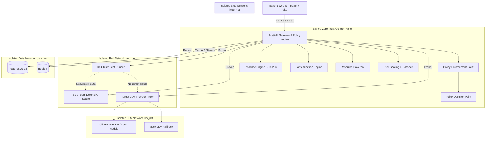

# Bayora — System Design

## 1. Zero-Trust Architecture Diagram

---

## 2. Core Execution Flow

1. **Test Initiation**: Red Team selects or constructs an adversarial payload.
2. **Confidential Vaulting**: Raw payload text is saved to `attack_payloads` table. The SHA-256 hash is generated and linked.
3. **Policy Gate Evaluation**: Gateway tests active Blue Team defenses against the prompt.
4. **Target Execution**: If not blocked by policy, the Gateway routes the prompt to the isolated Target LLM session.
5. **Telemetry Sanitization**: Model response classification is logged. Raw prompts are never sent to Blue Team channels.
6. **Evidence Chaining**: A new SHA-256 evidence block is chained to the evaluation's chronological ledger.
7. **Resource Accounting**: Execution latency and resource allocations are recorded.
8. **Trust Attestation**: Trust Score is dynamically recomputed and passport hash is updated.
